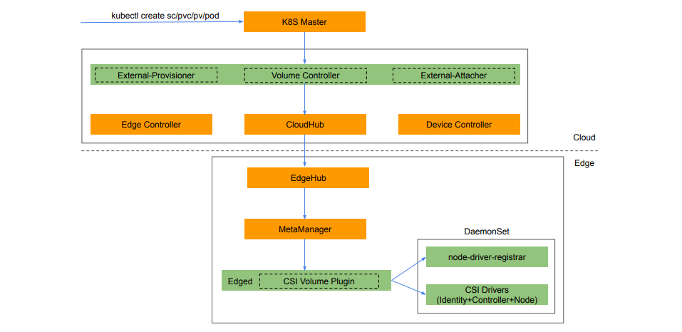
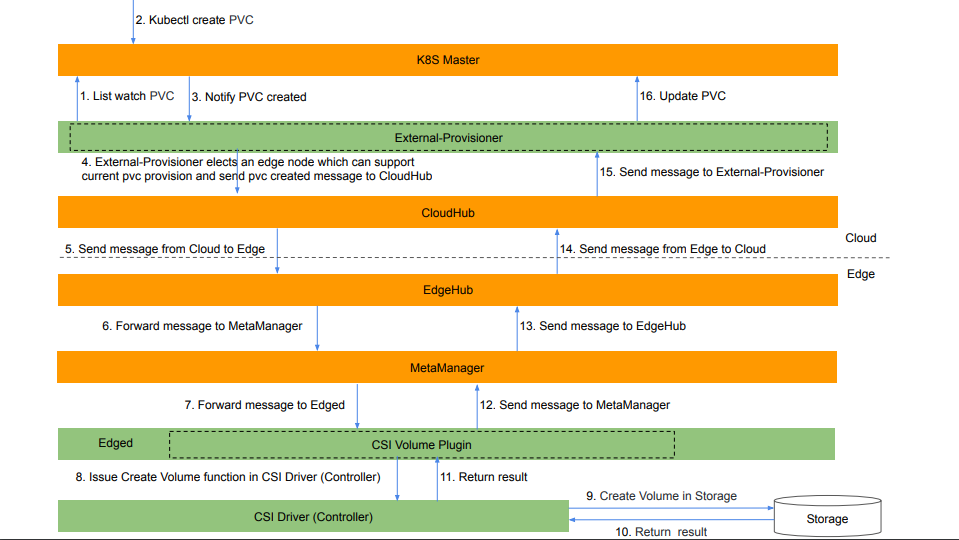
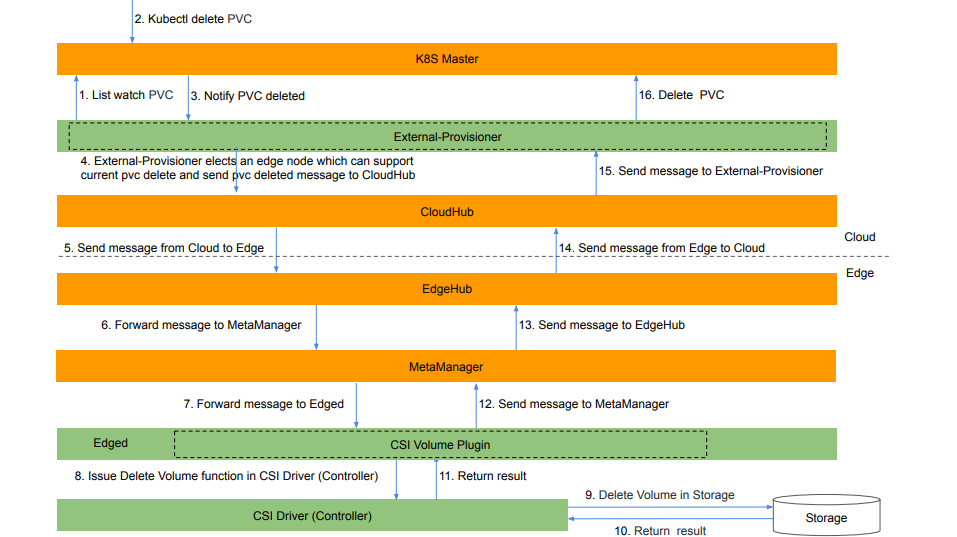

# Container Storage Interface Proposal

* [Container Storage Interface Proposal](#container-storage-Interface-proposal)
  * [Motivation](#motivation)
  * [Goals](#goals)
  * [Non\-goals](#non-goals)
  * [Proposal](#proposal)
    * [Requirement](#requirement)
    * [Architecture](#architecture)
    * [Workflow](#workflow)
    * [Deployment](#deployment)
    * [Example](#example)
  * [Work Items](#work-items)

## Motivation

Currently KubeEdge only supports the following volumes which are based on Kubernetes.

* [emptyDir](https://kubernetes.io/docs/concepts/storage/volumes/#emptydir)
* [hostPath](https://kubernetes.io/docs/concepts/storage/volumes/#hostpath)
* [configMap](https://kubernetes.io/docs/concepts/storage/volumes/#configmap)
* [secret](https://kubernetes.io/docs/concepts/storage/volumes/#secret)

That is not enough for the customers who are using KubeEdge.
The customers often need to store data and run stateful applications at edge.
For example, in a system which collects video data and then makes analysis,
one application stores the video data into a shared storage,
and another application reads the data from the storage to make analysis.
KubeEdge should allow customers to store data using StorageClass (SC),
PersistentVolume (PV) and PersistentVolumeClaim (PVC)
so that the customers can deploy stateful applications at edge.

The Container Storage Interface (CSI) is a specification that resulted from cooperation
between community members including Kubernetes, Mesos, Cloud Foundry, and Docker.
The goal of this interface is to establish a standardized mechanism
to expose arbitrary storage systems to their containerized workloads.
CSI Spec has already been released v1.1 and lots of CSI Drivers are released by vendors.
CSI Volume Plugin is supported beginning with kubernetes v1.9 and in GA status since v1.13.

* [CSI Spec](https://github.com/container-storage-interface/spec/blob/master/spec.md)
* [CSI Drivers](https://kubernetes-csi.github.io/docs/drivers.html)
* [CSI Volume Plugin in Kubernetes](https://github.com/kubernetes/community/blob/master/contributors/design-proposals/storage/container-storage-interface.md)

We can support Container Storage Interface (CSI) in KubeEdge,
and give a standardized solution to the customers who want to use persistent storage at edge.
The customers can choose any kind of CSI Drivers on demands. Since KubeEdge is built upon Kubernetes,
it is possible to reuse some of existing framework from Kubernetes in KubeEdge.

## Goals

* To support [basic CSI Volume Lifecycle](https://github.com/container-storage-interface/spec/blob/master/spec.md#volume-lifecycle) in KubeEdge.
   * Create Volume and Delete Volume.
   * Controller Publish Volume and Controller Unpublish Volume.
   * Node Stage Volume and Node Unstage Volume.
   * Node Publish Volume and Node Unpublish Volume.
* Compatiable with Kubernetes and CSI.

## Non-goals

* To support Raw Block Volume.
* To support Volume Snapshot and Restore.
* To support Volume Topology.

## Proposal

### Requirement
* Kubernetes v1.13+
* CSI Spec v1.0.0+

### Architecture


The added components in KubeEdge are including:
* External-Provisioner: list watch the Kubernetes API Resource `PersistentVolumeClaim` (`PVC`)
   and send messages to edge to invoke actions including `Create Volume` and `Delete Volume` at edge.
* External-Attacher: list watch the Kubernetes API Resource `VolumeAttachment` and send messages to edge
   to invoke actions including `Controller Publish Volume` and `Controller Unpublish Volume` at edge.
* Volume Controller: create the Kubernetes API Resource `VolumeAttachment` based on the messages from edge.
* CSI Volume Plugin: invoke actions including `Node Stage Volume` and `Node Unstage Volume`,
   `Node Publish Volume` and `Node Unpublish Volume` at edge.
* Node-Driver-Registrar: register the CSI Drivers into `Edged` by UNIX Domain Sockets.
* CSI Drivers: these drivers are chosen by the customers.

### Workflow

#### Create Volume


#### Delete Volume


### Deployment

Before using CSI Drivers, the cluster admins need to deploy a `DaemonSet` as a sidecar
to add support for the chosen CSI Drivers in KubeEdge.
Here is a deployment example for CSI NFS Driver.

```yaml
kind: DaemonSet
apiVersion: apps/v1beta2
metadata:
  name: csi-nfs-driver-ds
spec:
  selector:
    matchLabels:
      app: csi-nfs-driver-ds
  template:
    metadata:
      labels:
        app: csi-nfs-driverr-ds
    spec:
      hostNetwork: true
      containers:
        - name: node-driver-registrar
          image: quay.io/k8scsi/csi-node-driver-registrar:v1.0.2
          lifecycle:
            preStop:
              exec:
                command: ["/bin/sh", "-c", "rm -rf /registration/csi-nfs-driver/registration/csi-nfs-driver-reg.sock"]
          args:
            - --v=5
            - --csi-address=/plugin/csi.sock
            - --kubelet-registration-path=/var/lib/edged/plugins/csi-nfs-driver/csi.sock
          env:
            - name: KUBE_NODE_NAME
              valueFrom:
                fieldRef:
                  fieldPath: spec.nodeName
          volumeMounts:
            - name: plugin-dir
              mountPath: /plugin
            - name: registration-dir
              mountPath: /registration
        - name:  csi-nfs-driver
          securityContext:
            privileged: true
            capabilities:
              add: ["SYS_ADMIN"]
            allowPrivilegeEscalation: true
          image: quay.io/k8scsi/csi-nfs-driver:v1.0.0
          args :
            - "--nodeid=$(NODE_ID)"
            - "--endpoint=$(CSI_ENDPOINT)"
          env:
            - name: NODE_ID
              valueFrom:
                fieldRef:
                  fieldPath: spec.nodeName
            - name: CSI_ENDPOINT
              value: unix://plugin/csi.sock
          imagePullPolicy: "IfNotPresent"
          volumeMounts:
            - name: plugin-dir
              mountPath: /plugin
            - name: pods-mount-dir
              mountPath: /var/lib/edged/pods
              mountPropagation: "Bidirectional"
      volumes:
        - name: registration-dir
          hostPath:
            path: /var/lib/edged/plugins_registry
            type: Directory
        - name: plugin-dir
          hostPath:
            path: /var/lib/edged/plugins/csi-nfs-driver
            type: DirectoryOrCreate
        - name: pods-mount-dir
          hostPath:
            path: /var/lib/edged/pods
            type: Directory
```
The `DaemonSet` includes:
* The following containers:
  * `node-driver-registrar`: responsible for registering the unix domain socket with edged.
  * `csi-nfs-driver`: developped by the vendor.
* The following volumes:
  * `registration-dir` hostPath volume
      Expose `/var/lib/edged/plugins_registry` from the edge node.
      Mount only in `node-driver-registrar` container at `/registration`.
      `node-driver-registrar` will use this unix domain socket to register the CSI driver’s unix domain socket with Edged.
  * `plugin-dir` hostPath volume
      Expose `/var/lib/edged/plugins/csi-nfs-driver/` from the edge node as `hostPath.type: DirectoryOrCreate`.
      Mount inside `csi-nfs-driver` container which is the primary means of communication between Edged and the `csi-nfs-driver` container.
  * `pods-mount-dir` hostPath volume
      Expose `/var/lib/edged/pods` from the edge node.
      Mount only in 'csi-nfs-driver' container at `/var/lib/edged/pods/`.
      Ensure [bi-directional mount propagation](https://kubernetes.io/docs/concepts/storage/volumes/#mount-propagation) is enabled, 
      so that any mounts setup inside this container are propagated back to edge node host machine.

If it is not possible to deploy mutiple containers in  `DaemonSet` in some KubeEdge release versions,
The cluster admins need to deploy two DaemonSets which includes `csi-nfs-driver` and `node-driver-registrar` respectively.

### Example

#### Static Provision Example

Static Provision means the volume has already been created in somewhere.
There is no need to create volume by the `External-Provisioner`.
The customers can define it by PersistentVolume and PersistentVolumeClaim.
Here list the CSI NFS Driver as an example.

PersistentVolume Example:
```yaml
apiVersion: v1
kind: PersistentVolume
metadata:
  name: csi-nfs-pv
  labels:
    name: csi-nfs-pv
spec:
  accessModes:
  - ReadWriteMany
  capacity:
    storage: 1Gi
  csi:
    driver: csi-nfs-driver
    volumeHandle: data-id
    volumeAttributes:
      server: 127.0.0.1
      share: /export
```
Refer to the NFS share information and create a PersistentVolume.
`server: 127.0.0.1` and `share: /export` in the `volumeAttributes` are used to speficy the NFS share information.

PersistentVolumeClaim Example:
```yaml
apiVersion: v1
kind: PersistentVolumeClaim
metadata:
  name: csi-nfs-pvc
spec:
  accessModes:
  - ReadWriteMany
  resources:
    requests:
      storage: 1Gi
  selector:
    matchExpressions:
    - key: name
      operator: In
      values: [" csi-nfs-pv"]
```
Based on the PersistentVolume, this example is used to define PersistentVolumeClaim.
Once the PersistentVolumeClaim is created successfully,
the PersistentVolume will bound into PersistentVolumeClaim.

Pod binding PersistentVolumeClaim Example:
```yaml
kind: Pod
apiVersion: v1
metadata:
  name: my-csi-app
spec:
  containers:
    - name: my-frontend
      image: busybox
      volumeMounts:
      - mountPath: "/data"
        name: my-csi-volume
      command: [ "sleep", "1000000" ]
  volumes:
    - name: my-csi-volume
      persistentVolumeClaim:
        claimName: csi-nfs-pvc
```
`claimName: csi-hostpath-pvc` is the name of PersistentVolumeClaim.
Before the pod is startup, volume will be attached into the edge node, and then mount into pod.

#### Dynamic Provision Example

Dynamic Provision means the volume will be created by `External-Provisioner` firstly,
and then the volume will be attached into the edge node which is running the pod,
at last the volume will be mounted into the pod.
Here list the CSI HostPath Driver as an example.

StorageClass Example:
```yaml
apiVersion: storage.k8s.io/v1
kind: StorageClass
metadata:
  name: csi-hostpath-sc
provisioner: csi-hostpath-driver
reclaimPolicy: Delete
volumeBindingMode: Immediate
```
`provisioner: csi-hostpath-driver` is used to specify which kind of CSI Driver will be used.
`csi-hostpath` is defined in the CSI hostPath Driver.

PersistentVolumeClaim Example:
```yaml
apiVersion: v1
kind: PersistentVolumeClaim
metadata:
  name: csi-hostpath-pvc
spec:
  accessModes:
  - ReadWriteOnce
  resources:
    requests:
      storage: 1Gi
  storageClassName: csi-hostpath-sc
```
`storageClassName: csi-hostpath-sc` is used to specify the storage class name
which is defined in the StorageClass Example.
Once PersistentVolumeClaim is created, KubeEdge will create volume based on
the CSI Driver which is specified in the StorageClass, and the PersistentVolume
will be created in Kubernetes and bound to PersistentVolumeClaim.

Pod binding PersistentVolumeClaim Example:
```yaml
kind: Pod
apiVersion: v1
metadata:
  name: my-csi-app
spec:
  containers:
    - name: my-frontend
      image: busybox
      volumeMounts:
      - mountPath: "/data"
        name: my-csi-volume
      command: [ "sleep", "1000000" ]
  volumes:
    - name: my-csi-volume
      persistentVolumeClaim:
        claimName: csi-hostpath-pvc
```
`claimName: csi-hostpath-pvc` is the name of PersistentVolumeClaim.
Before the pod is startup, volume will be attached into the edge node, and then mount into pod.

## Work Items
* Volume Controller
* External-Provisioner
* External-Attacher
* CSI Volume Plugin in Edged
