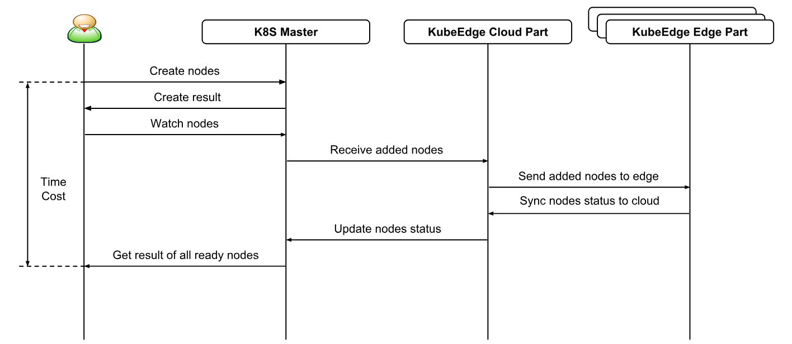
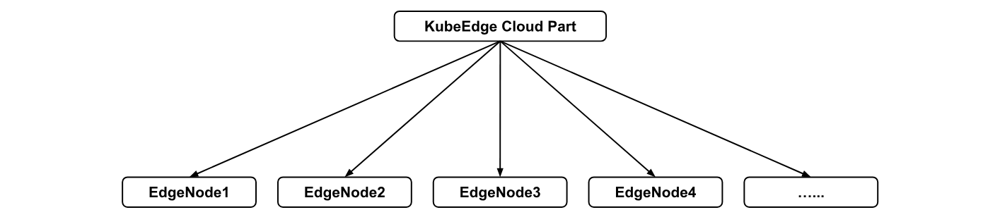

# Performance Test Proposal

* [Performance Test Proposal](#performance-test-proposal)
  * [Motivation](#motivation)
    * [Goals](#goals)
    * [Non\-goals](#non-goals)
  * [Proposal](#proposal)
    * [Test Framework](#test-framework)
    * [Test Tools](#test-tools)
    * [Metrics Tools](#metrics-tools)
  * [Test Scenarios](#test-Scenarios)

## Motivation

Currently KubeEdge test is focused on automated test suites for unit, integration and E2E test and validation.
KubeEdge allows the users to manage large scale of edge nodes, devices from cloud.
A set of test specifically performance test can be used to determine the non-functional
characteristics of KubeEdge such as latency, throughput, cpu usage, memory usage and so on.
As a result, we can also evaluate the future improvement items for KubeEdge.

This proposal lists the possible performance test scenarios and test cases for KubeEdge.

### Goals

* Benchmark the performance against the following Service Level Objectives:
  * Latency: time cost from the moment when the server gets the request to last byte of response sent to the users.
  * Throughput: measure how many requests can be served within given time.
  * Scalability: potential scaling capacity under different load conditions.
  * CPU Usage: measure the cpu usage of KubeEdge under different load conditions.
  * Memory Usage: measure the memory usage of KubeEdge under different load conditions.
* Performance test should be able to run against both dockerized and un-dockerized version of KubeEdge.

### Non-goals

* To design the specific implementation of single performance test.

## Proposal

### Test Framework

### Test Tools
* [Kubemark](https://github.com/kubernetes/kubernetes/tree/master/test/kubemark)
* [Fortio](https://github.com/fortio/fortio)

### Metrics Tools
* [Prometheus](https://github.com/prometheus/prometheus)
* [Grafana](https://github.com/grafana/grafana)

## Test Scenarios

### 1. Edge Nodes join in K8S Cluster

Test Cases:
* Measure Edge Nodes join in K8S Cluster startup time.

  Different numbers of Edge Nodes need be tested.

  Edge Nodes numbers are one of `[1, 10, 20, 50, 100, 200]`.

  This test case ends with all Edge Nodes are in `Ready` status.

### 2. Create Device/Device Model from Cloud

This scenario is expected to measure the northbound API of KubeEdge.

Test Cases:
* Measure the latency between K8S Master and KubeEdge Cloud Part.
* Measure the throughput between K8S Master and KubeEdge Cloud Part.

### 3. Report Device Status to Edge

This scenario is expected to measure the southbound API of KubeEdge.

Test Cases:
* Measure the latency between KubeEdge Edge Part and device.

  Device numbers are one of `[1, 10, 20, 50, 100, 200]`.

* Measure the throughput between KubeEdge Edge Part and device.

  Device numbers are one of `[1, 10, 20, 50, 100, 200]`.

As the result of the latency and throughput with different device numbers,
we can evaluate scalability of devices for KubeEdge Edge Part.
Measure the capacity of devices can be supported by KubeEdge Edge Part.

Different protocols are considered to test between KubeEdge Edge Part and devices.
E.g. Bluetooth, MQTT, ZigBee, BACnet and Modbus and so on.
Currenly less than 20ms latency can be accepted in Edge IoT scenario.
Two kinds of test cases can be adopted: emulators of different devices and actual devices.

### 4. Application Deployment from Cloud to Edge

This scenario is expected to measure the performance of KubeEdge from Cloud to Edge.
The docker image download latency is not included in this scenario.
In the following test cases, we need to make sure that docker images have already been in the Edge Node.

Test Cases:
* Measure the pod startup time.

  Edge Nodes numbers are one of `[1, 10, 20, 50, 100, 200]`.

  Pods numbers per Edge Node are one of `[1, 2, 5, 10, 20]`.

As the result of the pod startup time, we can evaluate scalability of KubeEdge Edge Nodes.
Measure the capacity of Edge Nodes can be supported by KubeEdge Cloud Part.

The simulation of generating virtual KubeEdge Edge Nodes are being analyzed with `Kubemark` framework.

The following deployment types of KubeEdge Edge Nodes can be used for test:

#### Deployment Type 1

Deploy K8S Master in VM1, KubeEdge Cloud Part in VM2, all KubeEdge Edge Nodes in VM2.

For Deployment Type 1, we use a dedicated VM for K8S Master setup(All master components running inside VM1).
In another VM, we run KubeEdge Cloud Part and all KubeEdge Edge Nodes processes together in the same VM.

Currently when we bring up the Edge Node process, it will start two handlers:
* MQTT internal broker on (tcp 0.0.0.0:1884).
* Edged Handler (tcp 0.0.0.0:10255).

E2E Framework will have to make sure to disable these handlers while bringing up the Edge Node process.
E2E Framework will use the external MQTT broker for event bus communication and disable the Edged Handler
(Disabling edged handler will have no impact as its only being used for GET pods from podmanager).
While doing Edge Node registration, E2E Framework will make sure the Edge Node
register with different node-id for respective Edge Node process, so that all the Edge Node
will be registered to K8S Master as a different Edge Node.

#### Deployment Type 2

Deploy K8s Master in VM1, KubeEdge Cloud Part in VM2, all KubeEdge Edge Nodes in VM3.

For Deployment Type 2, We use a dedicated vm for K8S Master setup(All master components running inside VM1).
In another VM we run KubeEdge Cloud Part. Dedicated VM for multiple Edge Node processes.

#### Deployment Type 3

Deploy K8S Master in VM1, KubeEdge Cloud Part in VM2, each KubeEdge Edge Node in dedicated VM.

### 5. Update Device Twin State from Cloud to Device

This scenario is expected to measure the E2E performance of KubeEdge.

Test Cases:
* Measure E2E latency.

  Edge Nodes numbers are one of `[1, 10, 20, 50, 100, 200]`.

  Device numbers are one of `[1, 10, 20, 50, 100, 200]`.

* Measure CPU and Memory Usage of KubeEdge Cloud Part.

  Edge Nodes numbers are one of `[1, 10, 20, 50, 100, 200]`.

  Device numbers are one of `[1, 10, 20, 50, 100, 200]`.

* Measure CPU and Memory Usage of KubeEdge Edge Part.

  Edge Nodes numbers are one of `[1, 10, 20, 50, 100, 200]`.

  Device numbers are one of `[1, 10, 20, 50, 100, 200]`.

These test cases should be run in both system idle and under heavy load.
