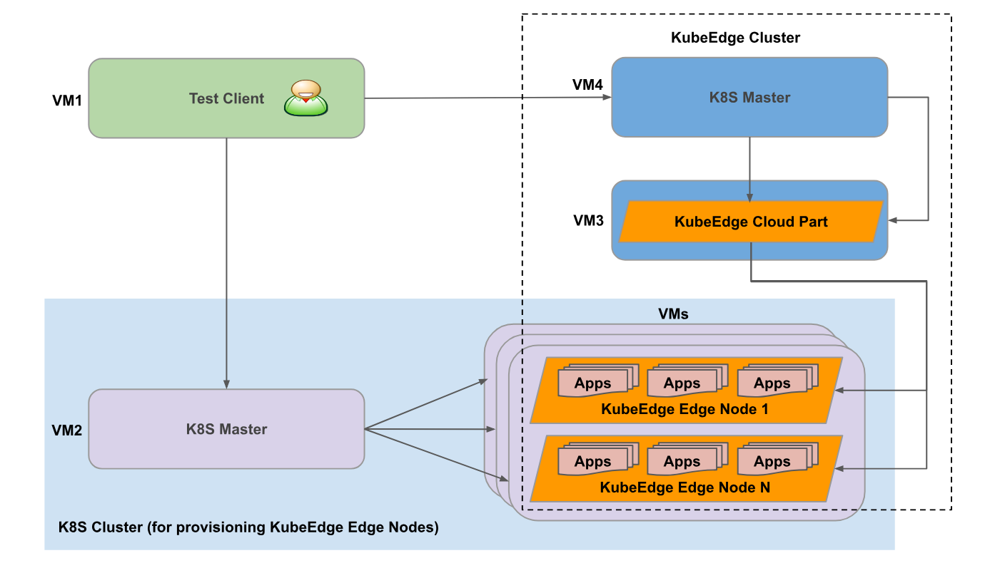
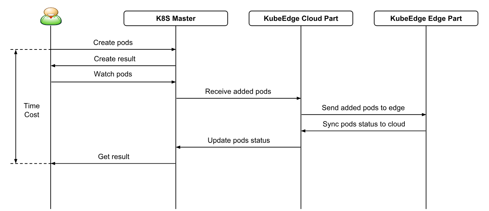

# Performance Test Proposal

* [Performance Test Proposal](#performance-test-proposal)
  * [Motivation](#motivation)
    * [Goals](#goals)
    * [Non\-goals](#non-goals)
  * [Proposal](#proposal)
    * [Performance Test Deployment](#performance-test-deployment)
    * [Performance Test Framework](#performance-test-framework)
    * [Performance Test Metrics Tools](#performance-test-metrics-tools)
    * [Performance Test Scenarios](#performance-test-scenarios)

## Motivation

Currently KubeEdge test is focused on automated test suites for unit, integration and E2E test and validation.
KubeEdge allows the users to manage large scale of edge nodes, devices from cloud.
A set of test specifically performance test can be used to determine the non-functional
characteristics of KubeEdge such as latency, throughput, cpu usage, memory usage and so on.
As a result, we can also evaluate the future improvement items for KubeEdge.

This proposal lists the possible performance test scenarios and test cases for KubeEdge.

### Goals

* Benchmark the performance against the following Service Level Objectives:
  * Latency: time cost from the moment when the server gets the request to last byte of response sent to the users.
  * Throughput: measure how many requests can be served within given time.
  * Scalability: potential scaling capacity under different load conditions.
  * CPU Usage: measure the cpu usage of KubeEdge under different load conditions.
  * Memory Usage: measure the memory usage of KubeEdge under different load conditions.
* Performance test should be able to run against both dockerized and un-dockerized version of KubeEdge.

### Non-goals

* To design the specific implementation of single performance test.

## Proposal

### Performance Test Deployment


### Requirement

To run KubeEdge performance you need a Kubernetes cluster for running all your KubeEdge Nodes and a dedicated machine for a KubeEdge Edge Controller and Cloud hub. KubeEdge Cloud machine has to be directly routable from KubeEdge Nodes. You also need an access to some Docker repository.

### KubeEdge Deployment Setup for Performance

Every running KubeEdge Performance Test setup looks like the following:

1. A real K8S Cluster that has master and nodes.
2. A separated VM where the KubeEdge Cloud Part Services are running, including Edge Controller and Cloud Hub and so on.
3. Test Client(E2E) will build KubeEdge EdgeNode image and put into the Docker Hub repository.
4. Test Client(E2E) uses the deployment controller to deploy KubeEdge EdgeNodes as pods with replicas.

When using the KubeEdge Performance Test, the developer is responsible for creating #1 and #2 above.

Test client will do the rest of the setup like building KubeEdge image and push the image to docker repository. Once the image is pushed sucessfully, test client use the deployment object to deploy KubeEdge nodes as pods and wait until all the pods comes up and **Running**.

### Performance Test Framework


Kubeedge performance framework will be designed based on the **Gomega** and **Ginkgo**. 

The performance test framework mainly consists of different types of tests releated to
- e2e test
- Scalability tests
- Latency tests
- Load test
- Common util

By default Performance framework will run all tests when user run the test/e2e/execute.sh script.
Also user can also provide the specific tests to run as a command line input to the **execute.sh** script.

Performance framework also has the support of a command line interface with plenty of handy command line arguments for running your tests and generating test files. Here are a few choice examples:

    - Ex:   perf.test -focus="Loadtest" and perf.test -skip="e2e_tests" 

#### Test Framework Features

- A comprehensive test runner
- Built-in support for testing asynchronicity
- Modular and easy to customize.
- Logging and Reporting.
- Scalable to add more features.
- Built-in support of command line interface.
    
#### Sample E2E Test

```
It("E2E_Test_1: Create deployment and check the pods are coming up correctly", func() {
			var deploymentList v1.DeploymentList
			var podlist metav1.PodList
			replica := 1
			//Generate the random string and assign as a UID
			UID = "deployment-app-" + utils.GetRandomString(5)
			IsAppDeployed := utils.HandleDeployment(http.MethodPost, ctx.Cfg.ApiServer+DeploymentHandler, UID, ctx.Cfg.AppImageUrl[1], nodeSelector, replica)
			Expect(IsAppDeployed).Should(BeTrue())
			err := utils.GetDeployments(&deploymentList, ctx.Cfg.ApiServer+DeploymentHandler)
			Expect(err).To(BeNil())
			for _, deployment := range deploymentList.Items {
				if deployment.Name == UID {
					label := nodeName
					podlist, err = utils.GetPods(ctx.Cfg.ApiServer+AppHandler, label)
					Expect(err).To(BeNil())
					break
				}
			}
			utils.CheckPodRunningState(ctx.Cfg.ApiServer+AppHandler, podlist)
		})
```

#### K8S Master
| Subject                        | Description                                  |
|--------------------------------|----------------------------------------------|
| OS                             |  Ubuntu 18.04 server 64bit                   |
| K8S Version                    |  v1.13.5                                     |
| Docker Version                 |  v17.09                                      |
| CPU                            |  32vCPUs                                     |
| RAM                            |  128GB                                       |
| Disk Size                      |  40GB                                        |
| Count                          |  1                                           |

This VM is used to run K8S Master Services including K8S API Server and K8S Scheduler and so on.

#### KubeEdge Cloud Part
| Subject                        | Description                                  |
|--------------------------------|----------------------------------------------|
| OS                             |  Ubuntu 18.04 server 64bit                   |
| Docker Version                 |  v17.09                                      |
| CPU                            |  32vCPUs                                     |
| RAM                            |  128GB                                       |
| Disk Size                      |  40GB                                        |
| Count                          |  1                                           |

This VM is used to run KubeEdge Cloud Part Services including Edge Controller and Cloud Hub and so on.

#### K8S Nodes
| Subject                        | Description                                  |
|--------------------------------|----------------------------------------------|
| OS                             |  Ubuntu 18.04 server 64bit                   |
| Docker Version                 |  v17.09                                      |
| CPU                            |  32vCPUs                                     |
| RAM                            |  128GB                                       |
| Disk Size                      |  40GB                                        |
| Count                          |  1...N                                       |

These VMs are used to deploy numbers of KubeEdge Edge Nodes pods which are running Edged and EdgeHub and so on.
We will adjust the Count of VMs based on the KubeEdge Edge Nodes numbers.

### Performance Test Metrics Tools
* [Prometheus](https://github.com/prometheus/prometheus)
* [Grafana](https://github.com/grafana/grafana)

### Performance Test Scenarios

#### 1. Edge Nodes join in K8S Cluster


Test Cases:
* Measure Edge Nodes join in K8S Cluster startup time.

  Different numbers of Edge Nodes need be tested.

  Edge Nodes numbers are one of `[1, 10, 20, 50, 100, 200]`.

  This test case ends with all Edge Nodes are in `Ready` status.

* Measure CPU and Memory Usage of KubeEdge Cloud Part.

  Edge Nodes numbers are one of `[1, 10, 20, 50, 100, 200]`.

* Measure CPU and Memory Usage of KubeEdge Edge Part.

  Edge Nodes numbers are one of `[1, 10, 20, 50, 100, 200]`.

#### 2. Create Devices from Cloud


This scenario is expected to measure the northbound API of KubeEdge.

Test Cases:
* Measure the latency between K8S Master and KubeEdge Cloud Part.
* Measure the throughput between K8S Master and KubeEdge Cloud Part.
* Measure CPU and Memory Usage of KubeEdge Cloud Part.

#### 3. Report Device Status to Edge


This scenario is expected to measure the southbound API of KubeEdge.

Test Cases:
* Measure the latency between KubeEdge Edge Part and device.

  Device numbers per Edge Node are one of `[1, 10, 20, 50, 100, 200]`.

* Measure the throughput between KubeEdge Edge Part and device.

  Device numbers per Edge Node are one of `[1, 10, 20, 50, 100, 200]`.

* Measure CPU and Memory Usage of KubeEdge Edge Part.

  Device numbers per Edge Node are one of `[1, 10, 20, 50, 100, 200]`.

As the result of the latency and throughput with different device numbers,
we can evaluate scalability of devices for KubeEdge Edge Part.
Measure how many devices can be handled per Edge Node.


Different protocols are considered to test between KubeEdge Edge Part and devices.
E.g. Bluetooth, MQTT, ZigBee, BACnet and Modbus and so on.
Currenly less than 20ms latency can be accepted in Edge IoT scenario.
Two kinds of test cases can be adopted: emulators of different devices and actual devices.

#### 4. Application Deployment from Cloud to Edge


This scenario is expected to measure the performance of KubeEdge from Cloud to Edge.
The docker image download latency is not included in this scenario.
In the following test cases, we need to make sure that docker images have already been in the Edge Node.

Test Cases:
* Measure the pod startup time.

  Edge Nodes numbers are one of `[1, 10, 20, 50, 100, 200]`.

  Pods numbers per Edge Node are one of `[1, 2, 5, 10, 20]`.

  This test case ends with all pods are in `Ready` status.

* Measure CPU and Memory Usage of KubeEdge Cloud Part.

  Edge Nodes numbers are one of `[1, 10, 20, 50, 100, 200]`.

  Pods numbers per Edge Node are one of `[1, 2, 5, 10, 20]`.

* Measure CPU and Memory Usage of KubeEdge Edge Part.

  Edge Nodes numbers are one of `[1, 10, 20, 50, 100, 200]`.

  Pods numbers per Edge Node are one of `[1, 2, 5, 10, 20]`.

As the result of the pod startup time, we can evaluate scalability of KubeEdge Edge Nodes.
Measure how many Edge Nodes can be handled by KubeEdge Cloud Part.
Measure how many pods can be handled per Edge Node.


#### 5. Update Device Twin State from Cloud to Device


This scenario is expected to measure the E2E performance of KubeEdge.

Test Cases:
* Measure E2E latency.

  Edge Nodes numbers are one of `[1, 10, 20, 50, 100, 200]`.

  Device numbers per Edge Node are one of `[1, 10, 20, 50, 100, 200]`.

* Measure CPU and Memory Usage of KubeEdge Cloud Part.

  Edge Nodes numbers are one of `[1, 10, 20, 50, 100, 200]`.

  Device numbers per Edge Node are one of `[1, 10, 20, 50, 100, 200]`.

* Measure CPU and Memory Usage of KubeEdge Edge Part.

  Edge Nodes numbers are one of `[1, 10, 20, 50, 100, 200]`.

  Device numbers per Edge Node are one of `[1, 10, 20, 50, 100, 200]`.

These test cases should be run in both system idle and under heavy load.
